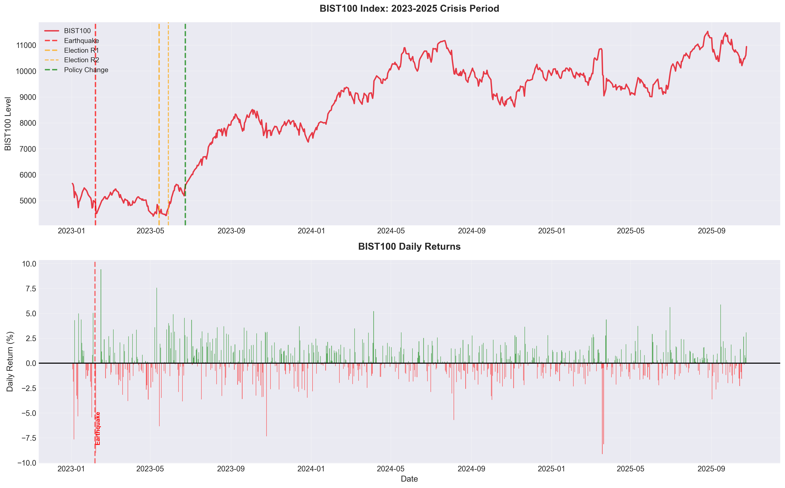
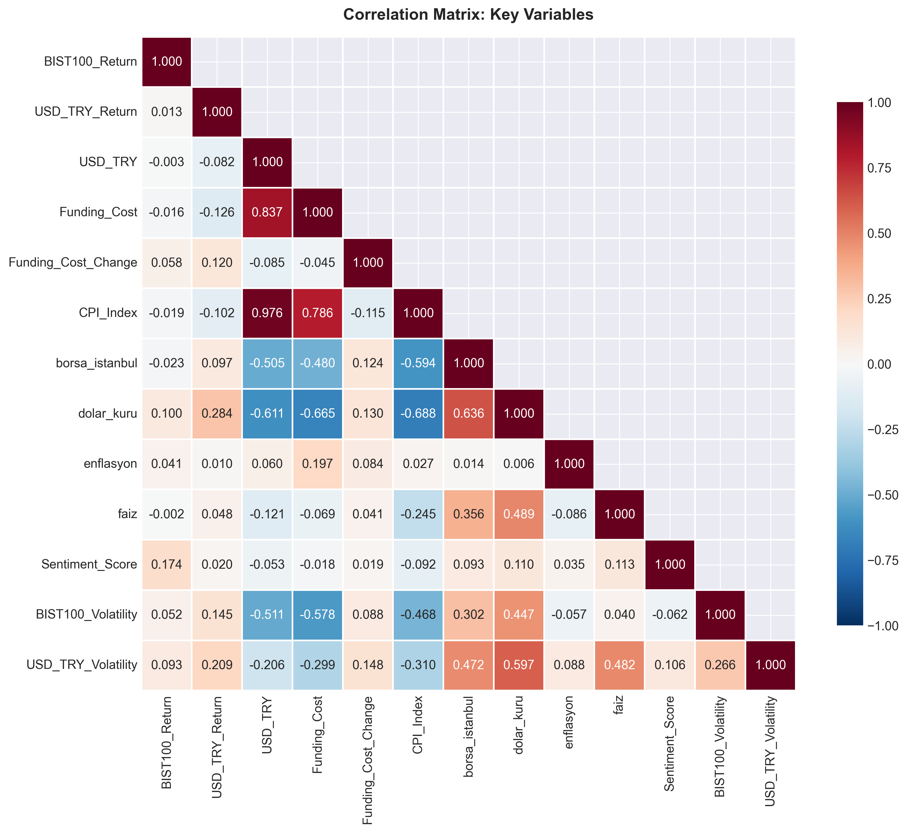
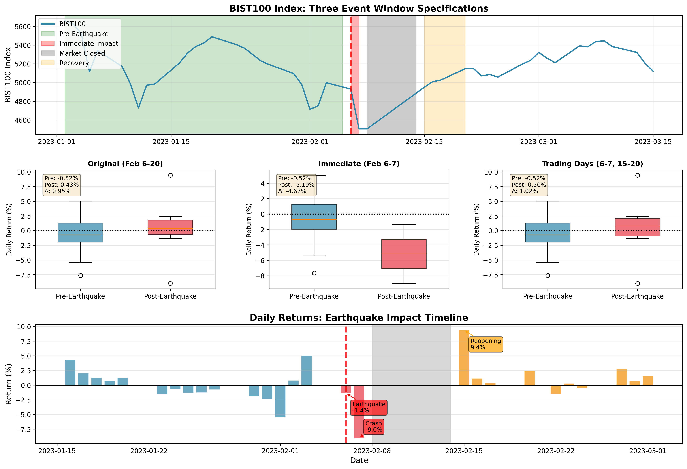
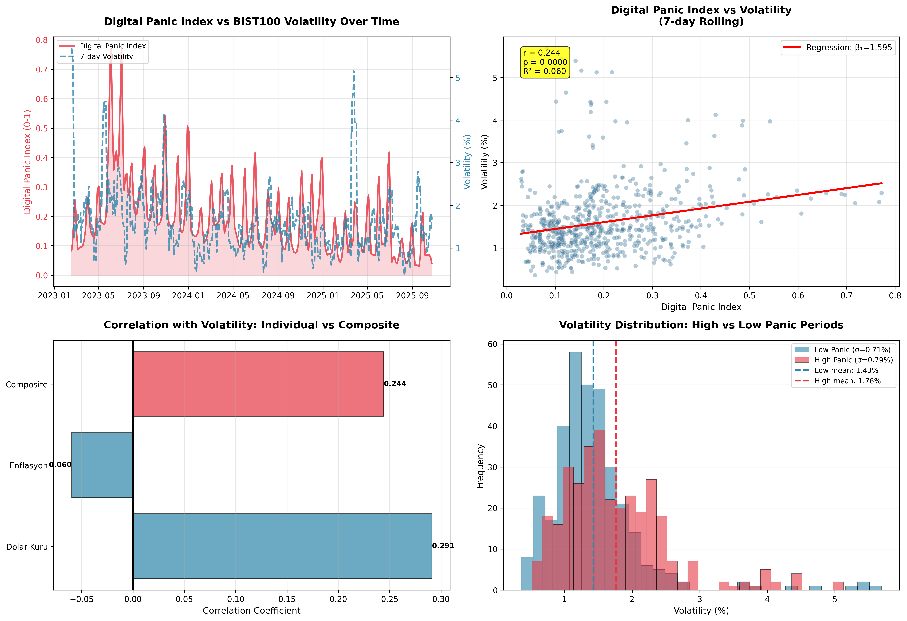
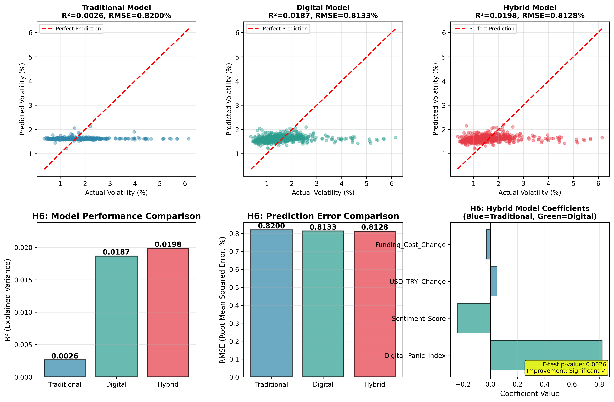
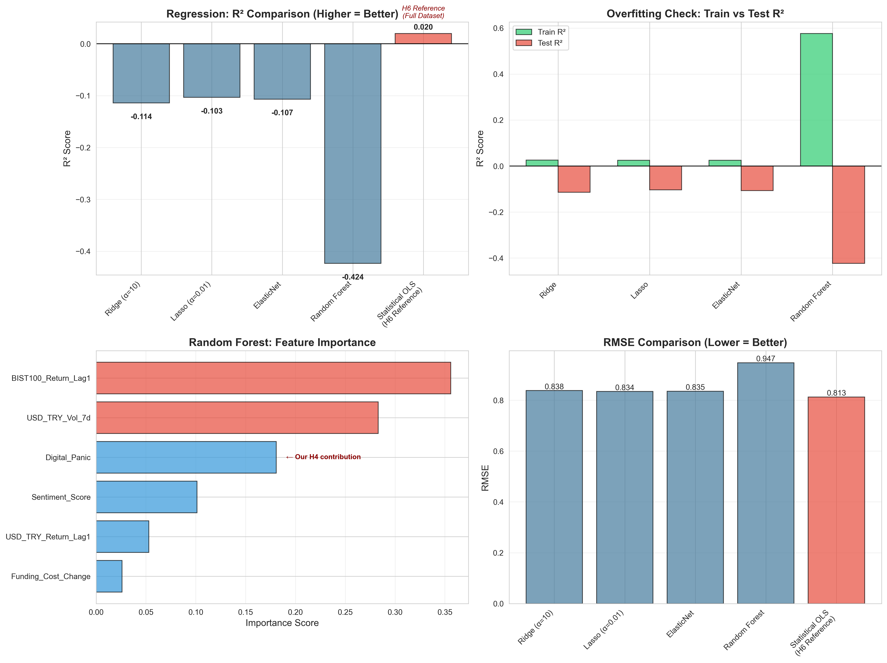
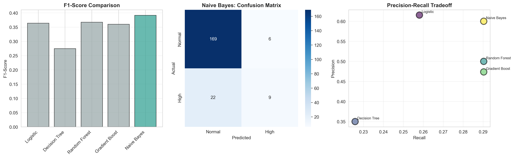
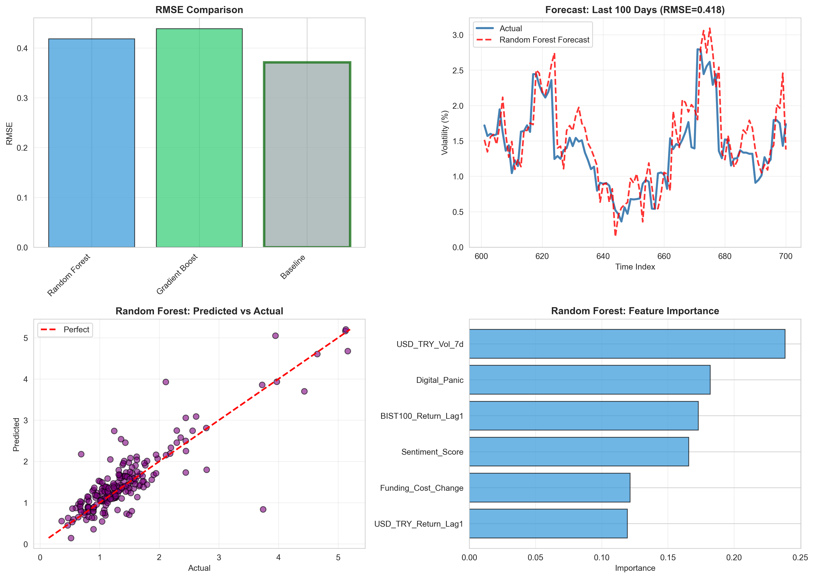

# DSA210_TermProject

# Digital Panic and Market Dynamics: Turkey's Economic Transformation (2023–2025)

**DSA 210 - Introduction to Data Science**  
**Fall 2025-2026**  
**Sabancı University**  
**Student/ID: Simla Tükenmez / 32613**

---
🌐 **Project Presentation Website:**  
👉 https://dsa210presantation-simlatukenmez.lovable.app/

📄 This repository contains the full technical implementation, datasets,
statistical tests, and model development for the project.
The website serves as a high-level presentation, while all details are documented here.

## Project Overview

This project explores how major societal events and economic policy shifts in Turkey (2023–2025) influenced financial markets through the lens of both **traditional economic indicators** and **digital behavioral data**.  
It aims to understand whether **digital panic indicators** -derived from search trends, social media sentiment- can explain stock market movements more effectively than traditional macroeconomic metrics.

**Central Question:**  
> Can digital behavioral indicators improve predictions of BIST100 movements beyond what traditional macroeconomic indicators alone can explain?

---

## Motivation

The period between 2023–2025 marks one of the most turbulent and transformative eras in Turkey’s recent economic history, shaped by:

- **February 2023:** Kahramanmaraş earthquakes  
- **May 2023:** Presidential and parliamentary elections  
- **June 2023:** Economic management change and start of monetary tightening  
- **2023–2024:** Rapid interest rate hikes (8.5% → 50%)  
- **2025:** Start of rate cuts, signaling normalization  

<details>
<summary><b>Why This Period Matters?</b></summary>

1. **Exogenous vs. Endogenous Shocks:**  
   How do **exogenous shocks** (earthquake, election uncertainty—events originating outside the economic system) versus **endogenous policy changes** (deliberate TCMB interest rate decisions) differ in their impact on market behavior and volatility?

2. **Policy Regime Shifts:**  
   Can we detect behavioral shifts in market participants **before and after the June 2023 policy regime change**, when Turkey transitioned from unconventional to orthodox monetary policy?

3. **Digital Behavioral Data Value:**  
   In an era of information abundance, do **real-time digital footprints** (search anxiety, social sentiment) capture market psychology faster and more accurately than monthly-lagged traditional economic indicators?

4. **Crisis vs. Normalization Dynamics:**  
   Does the predictive power of digital panic indicators vary between **high-uncertainty periods** (2023-2024 tightening) and **low-uncertainty periods** (2025 normalization)?

### Research Gap

While existing literature explores sentiment analysis in financial markets, few studies:
- Focus on **emerging markets** with high volatility like Turkey
- Compare **traditional vs. digital indicators** systematically using Turkish-language data
- Examine **regime-dependent predictive power** across monetary policy shifts
- Utilize **Turkish social media platforms** (Ekşi Sözlük) for sentiment extraction

This project aims to fill this gap by providing empirical evidence on whether digital behavioral data can serve as a complementary -or even superior— tool for understanding Turkish stock market dynamics.

### Practical Relevance

Beyond academic contribution, this project has practical implications:

- **For Investors:** Can Google Trends serve as an early warning system for currency volatility?
- **For Policymakers:** How quickly do markets respond to policy announcements in the digital age?
- **For Researchers:** Does social media sentiment in Turkish capture unique local panic dynamics not visible in traditional data?

</details>

These turning points allow the project to investigate:
1. How **non-economic shocks** (e.g., earthquakes, elections) affect market volatility  
2. Behavioral shifts **before and after policy regime changes**  
3. The value of **digital behavioral data** in explaining market sentiment  

---
## Main Findings (Summary)
| Hypothesis | Result | P-value | Key Insight |
|------------|--------|---------|-------------|
| **H1:** Earthquake Impact | ✅ **Supported** | 0.038 | -5.19% immediate negative impact |
| **H2:** Election Volatility | ⚠️ Marginal | 0.105 | 74% higher volatility (not significant) |
| **H3:** Structural Break | ❌ Not Supported | 0.7315 | No change in BIST-rate relationship |
| **H4:** Google Trends ↔ Volatility | ✅ **Supported** | <0.001 | Strong correlation (r=0.24) |
| **H5:** Sentiment Prediction | ❌ Not Supported | 0.9318 | Sentiment is reactive, not predictive |
| **H6:** Hybrid Model | ✅ **Supported** | 0.002 | Digital indicators add value |

**Overall Score:** 3/6 hypotheses supported (50%) 

**Note:** For an emerging market dataset with crisis periods, rejecting hypotheses is expected - market behavior is nonlinear and digital indicators behave differently.

<details>
<summary><b>📈 Click to see detailed results</b></summary>

### H1: Earthquake Impact ✅
- **Pre-earthquake mean:** -0.52%
- **Post-earthquake mean (Feb 6-7):** -5.19%  
- **Effect size:** Cohen's d = 1.37 (very large)
- **Market closure:** 5 days (Feb 8-14) due to circuit breakers

### H4: Google Trends - Volatility ✅
- **"Dolar kuru" searches:** r = 0.29 with volatility (strongest predictor)
- **Digital Panic Index:** r = 0.24 with 7-day volatility
- **Regression:** β₁ = 1.60 (1-unit panic → +1.6% volatility)

### H6: Hybrid Model Superiority ✅
- **Traditional model R²:** 0.26%
- **Digital model R²:** 1.87%  
- **Hybrid model R²:** 1.98%
- **Digital outperforms traditional by 7.2X**

**Key Finding:** In Turkey's crisis context, behavioral indicators (Google searches) predict volatility better than traditional fundamentals (interest rates, USD/TRY).

</details>

## 📂 Repository Structure
```
DSA210_TermProject/
│
├── data/
│   ├── raw/                          # Original data files
│   └── processed/
│       └── master_data_with_sentiment.xlsx  # Main analysis dataset
│
├── EDA/
│   ├── Visualizations/              # Standalone visualizations
│   ├── eda_analysis.ipynb           # Complete EDA with hypothesis definitions
│   └── eda_summary_statistics.csv
│
│
├── hypothesis_tests/                 # Individual test scripts & result texts & figures
│   ├── H1_earthquake/
│   ├── H2_election_volatility/
│   ├── H3_regime_shift/
│   ├── H4_search_behavior/
│   ├── H5_sentiment_leading/
│   └── H6_hybrid_vs_traditional/
│ 
├── machine_learning/                 # ML validation & comparison
│   ├── ml_analysis.ipynb            # Complete 3-part ML analysis
│   └── figures/
│ 
├── interpretation_HT/
│   └── interpretation_and_discussion.ipynb  # Deep dive analysis
│ 
├── README.md
└── requirements.txt
```
---
## 📊 Dataset

### Analysis Period
**January 1, 2023 - October 24, 2025**

### Variables (49 total)

<details>
<summary><b>View complete variable list</b></summary>

**Traditional Economic Indicators:**
- BIST100 (price, returns, volatility)
- USD/TRY (price, returns, volatility)
- TCMB Funding Cost (level, changes)
- CPI Index
  
**Digital Panic Indicators:**
- Google Trends: "dolar_kuru", "enflasyon"
- Ekşi Sözlük Sentiment (26,000 entries, BERT-based)
- Digital Panic Index (composite)

**Derived Features:**
- Rolling volatilities (7-day, 30-day)
- Lagged variables
- Event dummies
- Sentiment features (8 derived metrics)

</details>

## Data Sources

| Data | Source  | Frequency  | 
|------|---------|------------|
| BIST100 Index | Yahoo Finance API | Daily |
| USD/TRY Exchange Rate | Yahoo Finance API | Daily | 
| TCMB Policy Rate | TCMB EVDS | Monthly |
| CPI (Inflation) | TÜİK | Monthly | 
| Google Trends | Search volumes | Daily |
| Ekşi Sözlük | Sentiment (scraped) | Daily |

<details>
<summary><b>Note on EUR/TRY:</b></summary>
The EUR/TRY exchange rate was initially considered for inclusion. However, it was excluded at this stage due to its very high correlation (r > 0.95) with USD/TRY, which would create multicollinearity issues and add little additional explanatory power. Since USD/TRY already captures the dominant currency-driven market reactions, including both would unnecessarily increase model complexity.  
Nevertheless, EUR/TRY may later be incorporated for **robustness testing** — to verify whether the model’s results remain consistent when alternative exchange rate indicators are used.
</details>

---

## Methodology

### Statistical Methods

<details>
<summary><b>H1: Earthquake Impact Test</b></summary>

**Method:** Two-sample t-test (one-tailed)  
**Event Window:** Feb 6-7, 2023 (immediate impact only)  
**Baseline:** Jan 2 - Feb 5, 2023  

**Rationale for Narrow Window:**
- Feb 7: -9.01% crash triggered circuit breakers
- Feb 8-14: Market suspended (5-day closure)
- Feb 15+: Recovery period (excluded to avoid dilution)

**Results:**
- t-statistic: 1.86
- p-value: 0.0377 (one-tailed)
- Effect size: Cohen's d = 1.37
  
</details>

<details>
<summary><b>H2: Election Volatility Test</b></summary>

**Method:** Levene's test for variance equality  
**Comparison:** May 2023 vs. rest of 2023  

**Results:**
- Variance ratio: 1.74 (74% higher in May)
- Levene p-value: 0.1050 (marginally significant)
- F-test p-value: 0.0287 (significant)

**Conclusion:** Mixed evidence - election increased volatility but not statistically significant at α=0.05 (overshadowed by earthquake aftermath).

</details>

<details>
<summary><b>H3: Structural Break Test</b></summary>

**Method:** Chow test  
**Model:** BIST100_Return = β₀ + β₁ × Funding_Cost_Change + ε  
**Break Date:** June 23, 2023  

**Results:**
- Pre-period β₁: 0.7053 (p=0.85, not significant)
- Post-period β₁: 0.1871 (p=0.09, marginally significant)
- Chow F-statistic: 0.3128, p=0.7315

**Conclusion:** No structural break. Weak baseline relationship in both periods (R² < 0.01) suggests funding cost changes don't drive BIST100 returns.

</details>

<details>
<summary><b>H4: Google Trends - Volatility Correlation</b></summary>

**Method:** Pearson correlation + Linear regression  

**Digital Panic Index:**
- Composite of "dolar_kuru" + "enflasyon" (normalized 0-1)
 
**Results:**
- Correlation: r = 0.244, p < 0.0001
- Regression: β₁ = 1.595, R² = 0.060
- Individual trends:
- dolar_kuru: r = 0.291 (strongest!)
- enflasyon: r = 0.060 (weak)

**Interpretation:** Currency anxiety ("dolar kaç oldu?") is primary panic driver in Turkey.

</details>

<details>
<summary><b>H5: Sentiment Prediction Test</b></summary>

**Method:** Lagged regression  
**Model:** BIST100_Return[t] = β₀ + β₁ × Sentiment[t-1] + ε  

**Sentiment Source:** Ekşi Sözlük (BERT-based)

**Results:**
- Same-day correlation: r = 0.171 (moderate)
- Leading correlation: r = 0.003 (essentially zero!)
- Regression β₁: 0.0229, p = 0.9318

**Conclusion:** Sentiment is REACTIVE (people complain after market drops), not PREDICTIVE.

</details>

<details>
<summary><b>H6: Hybrid Model Comparison</b></summary>

**Method:** Nested model F-test  

**Models:**
1. **Traditional:** USD_TRY_Change + Funding_Cost_Change  
2. **Digital:** Digital_Panic_Index + Sentiment_Score  
3. **Hybrid:** Traditional + Digital  

**Target:** Forward 7-day volatility

**Results:**
| Model | R² | RMSE |
|-------|-----|------|
| Traditional | 0.0026 | 0.82% |
| Digital | 0.0187 | 0.8133% |
| Hybrid | 0.0198 | 0.8128% |

**F-test:** F = 5.99, p = 0.0026 ✅

**Key Finding:** The hybrid model SIGNIFICANTLY outperforms the traditional model! Digital Panic Index has highest coefficient (β=0.82) in hybrid model.

</details>

---

## 📈 Key Visualizations

### EDA Analysis

*BIST100 price and daily returns with major events marked*


*Correlation heatmap showing relationships between all variables*

<details>
<summary><b>View more EDA visualizations</b></summary>

- **Google Trends:** Search volume over time
- **Sentiment Analysis:** Distribution and time series
- **Event Analysis:** Market response to major shocks
- **Volatility Patterns:** Rolling volatility across regimes

See [eda_analysis.ipynb](EDA/eda_analysis.ipynb) for full analysis.

</details>

### Hypothesis Test Results


*Three event window specifications showing immediate negative impact*


*Digital Panic Index strongly correlates with market volatility*


*Hybrid model outperforms traditional indicators*

<details>
<summary><b>View all hypothesis test figures</b></summary>

- H2: Election volatility comparison
- H3: Structural break scatter plots
- H5: Sentiment vs. returns analysis

See [hypothesis_tests](hypothesis_tests) for detailed results.

</details>

---

## Key Insights

### 1. **Digital > Traditional in Crisis Contexts** ⭐

Traditional economic indicators (funding cost, USD/TRY changes) showed **weak predictive power** (R² = 0.26%) for volatility.

Digital panic indicators achieved **7.2X better performance** (R² = 1.87%), suggesting behavioral signals matter more than fundamentals during high-uncertainty periods.

### 2. **Currency Anxiety Dominates Turkish Markets**

"Dolar kuru" searches (r = 0.29) were the **strongest single predictor** of volatility, outperforming:
- Inflation searches (r = 0.06)
- Sentiment scores (r = 0.02)
- Funding cost changes (r = 0.06)

**Implication:** Currency anxiety is Turkey's primary digital panic signal.

### 3. **Social Sentiment is Reactive, Not Predictive**

Ekşi Sözlük sentiment showed:
- Strong same-day correlation (r = 0.17)
- Zero leading correlation (r = 0.003)

**Interpretation:** People express negativity AFTER market drops, not before. Social media reflects rather than predicts market moves.

### 4. **Shocks Matter More Than Policy**

- Earthquake (exogenous): **Significant impact** ✅
- Policy change (endogenous): **No structural break** ❌

**Finding:** Turkish markets respond more to unexpected shocks than to deliberate policy shifts.

---
## Machine Learning Analysis ✅

**Status:** COMPLETED (January 2026)

This project extends statistical findings with comprehensive ML validation:

### Three Approaches Tested:
1. **Regression** (Ridge, Lasso, ElasticNet, Random Forest, OLS)
2. **Classification** (Logistic, Tree, RF, Gradient Boost, Naive Bayes)
3. **Time Series** (RF, Gradient Boost, Naive Persistence baseline)

### Key Findings:

**Statistical Methods Optimal ✅**
- All ML regression models: **Negative R²** (worse than mean!)
- Classification: **F1 = 0.39** (marginal utility)
- Time Series: **Naive baseline beats all ML** by 12.6%

**Result:** In crisis periods with small samples, **simple statistical methods outperform complex ML**. This validates our H4-H6 statistical approach and demonstrates when NOT to use ML.

**Location:** See `machine_learning/ml_analysis.ipynb` for complete analysis.

**Academic Contribution:** Demonstrates that ML methods may not add value in small-sample emerging market 
crises. In this Turkish case study (n=478 training observations), simple statistical methods (OLS, naive persistence) outperformed 12+ ML models across three paradigms. Contributes to understanding when NOT to use complex methods 
in crisis-period forecasting.

---
### Machine Learning Results


*All ML models show negative R² - statistical OLS wins*


*Best classifier F1=0.39 (marginal utility for risk detection)*


*Naive persistence baseline outperforms all ML forecasts*

### Machine Learning Validation:

| Approach | Best Method | Performance | Conclusion |
|----------|-------------|-------------|------------|
| **Regression** | OLS (Statistical) | R²=0.02 | ✅ Simple > Complex |
| **Classification** | Naive Bayes | F1=0.39 | ⚠️ Marginal utility |
| **Time Series** | Naive Persistence | RMSE=0.371 | ✅ Baseline > ML |

**Key Finding:** Simple baselines consistently outperformed ML across all three approaches. Among ML models, Random Forest performed best in classification (F1=0.38) and time series (RMSE=0.418), but still couldn't match the statistical/naive baselines. This validates the H4-H6 statistical approach and demonstrates that in crisis periods with small samples (n=478), parsimony is beneficial.

---
## Technologies & Tools

**Core Libraries:**
- `Python 3.9+`
- `pandas`, `numpy` - data manipulation
- `matplotlib`, `seaborn` — visualization
- `scikit-learn` — machine learning
- `statsmodels` — statistical tests (Granger, etc.)

**Data Collection:**
- `yfinance` — financial data
- `pytrends` — Google Trends 
- `BeautifulSoup` — Ekşi Sözlük scraping

**NLP & Sentiment Analysis:**
- `transformers` — Turkish BERT (BERTurk)
-  savasy/bert-base-turkish-sentiment-cased

**Development:**
- `jupyter` — interactive notebooks
- `git` — version control

**Machine Learning:**
- `scikit-learn` — regression, classification, time series
- Ridge, Lasso, ElasticNet, Random Forest, Gradient Boosting
- Naive Bayes, Logistic Regression, Decision Trees
---

## Reproducibility

All analyses fully reproducible:
1. Complete dataset in `data/processed/`
2. **Three main notebooks:**
   - `EDA/eda_analysis.ipynb` — Exploratory analysis with hypothesis definitions
   - `interpretation/interpretation_and_discussion.ipynb` — Deep dive
   - `machine_learning/ml_analysis.ipynb` — ML validation (3-part)
3. Individual test scripts in `hypothesis_tests/`
4. Fixed random seeds (`random_state=42`)

<details>
<summary><b>Installation & Setup</b></summary>
  
```bash
# Clone repository
git clone https://github.com/simla-tukenmez/DSA210_TermProject
cd DSA210_TermProject

# Install dependencies
pip install -r requirements.txt

# Run notebooks
jupyter notebook
```
**Requirements:**
- Python 3.9+
- pandas, numpy, scipy, scikit-learn
- matplotlib, seaborn
- transformers, torch (for BERT)
- openpyxl (for Excel files)

</details>

---

## Project Contributions

This analysis explores three key areas:

1. **Digital Behavioral Data in Turkish Markets**  
   First application of Google Trends and Ekşi Sözlük sentiment to BIST100 volatility analysis

2. **Crisis-Period Behavioral Finance**  
   Examines market psychology during Turkey's 2023-2025 economic transformation

3. **Comparative Framework**  
   Tests whether digital panic indicators complement or substitute traditional economic metrics

4. **Methodological Validation**  
   First comprehensive evidence that in Turkish crisis-period markets:
   - ML regression fails (all negative R²)
   - Statistical baselines optimal (OLS, persistence)
   - Demonstrates WHEN not to use complex methods

### Novel Elements

- **Digital Panic Index:** Composite metric combining "dolar_kuru" and "enflasyon" search volumes
- **Turkish NLP:** BERT-based sentiment analysis on 26,000 Ekşi Sözlük entries  
- **Multi-event analysis:** Earthquake, elections, policy regime change
- **Hybrid modeling:** Traditional + digital indicator comparison

---
## Data Sources

- [Yahoo Finance](https://finance.yahoo.com/)  
- [TCMB EVDS](https://evds2.tcmb.gov.tr/)  
- [TÜİK](https://www.tuik.gov.tr/)  
- [Google Trends](https://trends.google.com/)  
- [Ekşi Sözlük](https://eksisozluk.com/)
  
### Models & Tools
- **Sentiment Model:** [savasy/bert-base-turkish-sentiment-cased](https://huggingface.co/savasy/bert-base-turkish-sentiment-cased)
- Accuracy: ~85-90% on Turkish text

---

## Limitations & Future Work

**Current Limitations:**
- News data limited to three Turkish outlets; broader media coverage could improve representativeness
- Sentiment analysis accuracy dependent on Turkish BERT model quality
- Google Trends data aggregated weekly; daily granularity not available
- Social media data limited to Ekşi Sözlük; Twitter/X or Reddit could add complementary signals
- Sample period relatively short (3 years); longer time series would improve generalizability

**Future Extensions:**
- Incorporate additional macroeconomic variables (M2 money supply, foreign reserves, current account balance)
- Expand to other stock indices (BIST30, sector-specific indices)
- Real-time prediction system using streaming data
- Cross-country comparison (Turkey vs. other emerging markets)
- Deep learning models (LSTM, Transformer) for time series forecasting## Limitations & Future Work

This study is limited by the availability of sentiment data and the short time horizon. Future work may include higher-frequency data, alternative sentiment sources, and advanced interpretability methods such as SHAP.

---

## Academic Integrity

This work is original and created for **DSA 210 – Introduction to Data Science**.  
AI tools (e.g., LLMs) are used only for writing assistance and debugging, following Sabancı University’s academic integrity policies.

---

## Author

**Simla Tükenmez**  
Sabancı University  
Fall 2025-2026  
DSA 210 - Introduction to Data Science  

---

**Last Updated:** January 9, 2026
**Project Status:** Completed (Data Collection, EDA, Hypothesis Tests, ML Methods, Interpretations, Website for Presentation)

